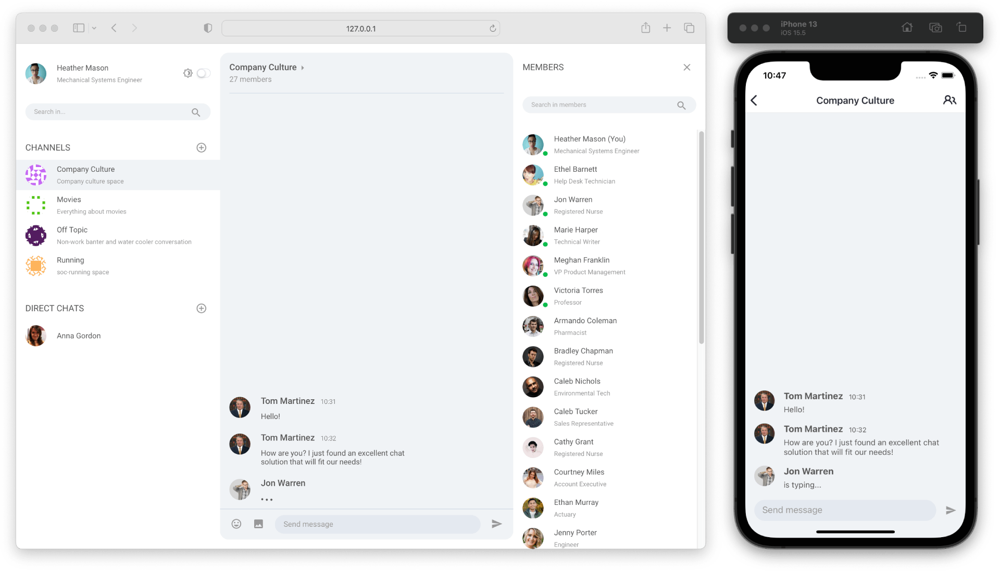

# PubNub Chat Components for React and React Native

PubNub Chat Components for React and React Native are the fastest way to add chat features like direct and group messaging, typing indicators, or reactions, without going through the complexity of the low-level architecture of real-time networks.

- **Reduced Implementation Time**: Develop proof-of-concept and production-ready apps faster using predefined components.
- **Fast and Simple Extensibility**: Add rich features, like typing indicators, read receipts, or reactions, without writing complex code.
- **Flexible and Customizable Components**: Customize component design and add custom components to extend functionality.
- **High Scalability**: Let PubNub take care of scaling and reliability as you grow your app.
- **Easy Theming**: Use the built-in light and dark themes or create custom ones for various use cases: group, support, and event chats.
- **Strong Typing**: Utilize the power of TypeScript to develop your application.

## Features

- **User and Channel Metadata**: Add additional information about the users, channels, and their memberships from PubNub Objects storage using custom hooks
- **Subscriptions**: Subscribe to user channels automatically
- **Messages**: Publish and display new and historical text messages
- **Presence**: Get currently active users, observe their state, and notify them about changes
- **Typing Indicators**: Display notifications that users are typing
- **Message Reactions**: Publish and add emojis to messages

## Available components

- Chat Provider - [React](https://www.pubnub.com/docs/chat/components/react/chat-provider) / [React Native](https://www.pubnub.com/docs/chat/components/react-native/chat-provider)
- Message List - [React](https://www.pubnub.com/docs/chat/components/react/ui-components/message-list) / [React Native](https://www.pubnub.com/docs/chat/components/react-native/ui-components/message-list)
- Message Input - [React](https://www.pubnub.com/docs/chat/components/react/ui-components/message-input) / [React Native](https://www.pubnub.com/docs/chat/components/react-native/ui-components/message-input)
- Channel List - [React](https://www.pubnub.com/docs/chat/components/react/ui-components/channel-list) / [React Native](https://www.pubnub.com/docs/chat/components/react-native/ui-components/channel-list)
- Member List - [React](https://www.pubnub.com/docs/chat/components/react/ui-components/member-list) / [React Native](https://www.pubnub.com/docs/chat/components/react-native/ui-components/member-list)
- Typing Indicator - [React](https://www.pubnub.com/docs/chat/components/react/ui-components/typing-indicator) / [React Native](https://www.pubnub.com/docs/chat/components/react-native/ui-components/typing-indicator)

## Prerequisites

- React v16.8+
- ReactDOM v16.8+ or React Native v0.69+
- [PubNub JavaScript SDK v4.29+](https://www.pubnub.com/docs/sdks/javascript/)
- [PubNub React SDK v2.1.0+](https://www.pubnub.com/docs/chat/react/setup)

## Usage

Start by exploring our demo apps that were built using chat components:

| Source code | React | React Native | Description |
| :-- | :-- | :-- | --- |
| [`getting-started`](https://github.com/pubnub/react-chat-components/tree/master/samples/react/getting-started) | [Tutorial](https://www.pubnub.com/docs/chat/components/react) | [Tutorial](https://www.pubnub.com/docs/chat/components/react-native) | Sample 1:1 chat app to get started |
| [`group-chat`](https://github.com/pubnub/react-chat-components/tree/master/samples/react/group-chat) | [Demo](https://react-components-chat.pubnub.com/) / [Tutorial](https://www.pubnub.com/tutorials/group-chat-tutorial-react/) | - | Complex moderated group chat app |
| [`live-events`](https://github.com/pubnub/react-chat-components/tree/master/samples/react/live-events) | [Demo](https://rcc-live-event.surge.sh/) / [Tutorial](https://www.pubnub.com/tutorials/virtual-events-tutorial-react/) | - | Live events app with a chat panel |
| [`telehealth`](https://github.com/pubnub/react-chat-components/tree/master/samples/react/telehealth) | [Demo](https://rcc-telehealth.surge.sh/) / [Tutorial](https://www.pubnub.com/tutorials/cross-platform-chat-application-telehealth-react/) | - | Simple patient-doctor chat app |

## Related documentation

- [PubNub Chat Components for React Documentation](https://www.pubnub.com/docs/chat/components/react) - documentation explaining how to work with PubNub Chat Components for React
- [PubNub Chat Components for React Native Documentation](https://www.pubnub.com/docs/chat/components/react-native) - documentation explaining how to work with PubNub Chat Components for React Native
- [PubNub chat use-case](https://www.pubnub.com/docs/chat/overview) - documentation for the chat use-case
- [PubNub React SDK](https://www.pubnub.com/docs/chat/react/setup) - API documentation for the PubNub React SDK

## Support

If you need help or have a general question, [contact support](mailto:support@pubnub.com).
