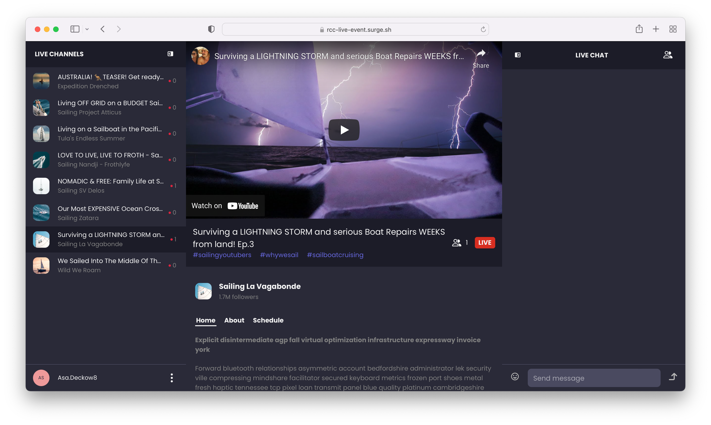

# Live Event Chat

`live-event-chat` is an app that simulates a live event. You can switch between multiple chananels, send messages, view channel occupancy and the participant list. The app comes with the light and dark themes.



## Prerequisites

This application uses [React v16.8+](https://www.npmjs.com/package/react/v/16.8.0), [ReactDOM v16.8+](https://www.npmjs.com/package/react-dom), [PubNub JavaScript SDK v4.29+](https://www.pubnub.com/docs/sdks/javascript/), and [PubNub React SDK v2.1.0+](https://www.pubnub.com/docs/chat/react/setup).

To use the app, you need:

* [npm](https://docs.npmjs.com/cli/v6/commands/npm-install)
* [Node.js](https://nodejs.org/en/download/)
* Code editor (e.g. [Visual Studio Code](https://code.visualstudio.com/download))
* PubNub [account](https://www.pubnub.com/docs/setup/account-setup) on the
[Admin Portal](https://admin.pubnub.com/) with [Publish and Subscribe Keys](https://www.pubnub.com/docs/basics/initialize-pubnub) for your chat app with the default configuration.

## Usage

Follow the steps to run the app locally.

1. Clone the repository.

    ```bash
    git clone https://github.com/pubnub/react-chat-components.git
    ```

1. Go to the `samples/live-event-chat` folder.

    ```bash
    cd samples/live-event-chat
    ```

1. Install the dependencies.

    ```bash
    npm install
    ```

1. Copy the `.env.example` file as `.env` and paste your Publish and Subscribe Keys there.

1. Run the application.

    ```bash
    npm start
    ```

## Components

The `live-event-chat` app showcases these PubNub Chat Components for React:

* [Chat Provider](https://pubnub.github.io/react-chat-components/docs/?path=/docs/components-chat-provider--default)
* [Channel List](https://pubnub.github.io/react-chat-components/docs/?path=/docs/components-channel-list--default)
* [Member List](https://pubnub.github.io/react-chat-components/docs/?path=/docs/components-member-list--default)
* [Message List](https://pubnub.github.io/react-chat-components/docs/?path=/docs/components-message-list--default)
* [Message Input](https://pubnub.github.io/react-chat-components/docs/?path=/docs/components-message-input--default)

