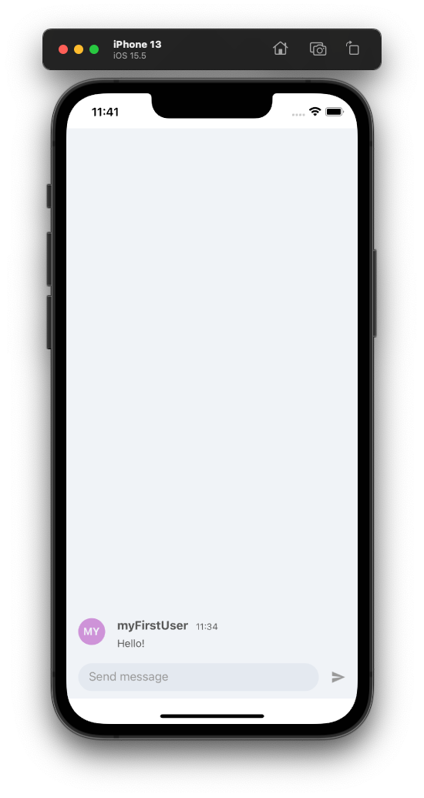

# Getting Started

`getting-started` is a simple app that allows you to get a 1:1 chat app quickly up and running through the PubNub Network. It features a simple chat window with a message input field. After starting the app, you can send sample messages as the default `myFirstUser` by typing them in an input field, and messages will pile up on the screen as you send them.

## Prerequisites

This application uses [React v18.0.0](https://www.npmjs.com/package/react/v/18.0.0), [React Native v0.69.5](https://www.npmjs.com/package/react-native), [PubNub JavaScript SDK v7.2.0](https://www.pubnub.com/docs/sdks/javascript/), and [PubNub React SDK v3.0.1](https://www.pubnub.com/docs/chat/react/setup).

To use the app, you need:

- [yarn](https://classic.yarnpkg.com/en/docs/install)
- [Node.js Latest LTS Version: 16.18.0](https://nodejs.org/en/download/)
- Code editor (e.g. [Visual Studio Code](https://code.visualstudio.com/download))
- PubNub [account](https://www.pubnub.com/docs/setup/account-setup) on the [Admin Portal](https://admin.pubnub.com/) with [Publish and Subscribe Keys](https://www.pubnub.com/docs/basics/initialize-pubnub) for your chat app. The autogenerated Demo Keyset in My First App already contains the configuration required to complete this guide.

## Usage

Follow the steps in the [Getting Started guide](https://www.pubnub.com/docs/chat/components/react-native) to run the app locally.

## Components

The `getting-started` app showcases these PubNub Chat Components for React Native:

- [Chat Provider](https://www.pubnub.com/docs/chat/components/react-native/chat-provider)
- [Message List](https://www.pubnub.com/docs/chat/components/react-native/ui-components/message-list)
- [Message Input](https://www.pubnub.com/docs/chat/components/react-native/ui-components/message-input)
