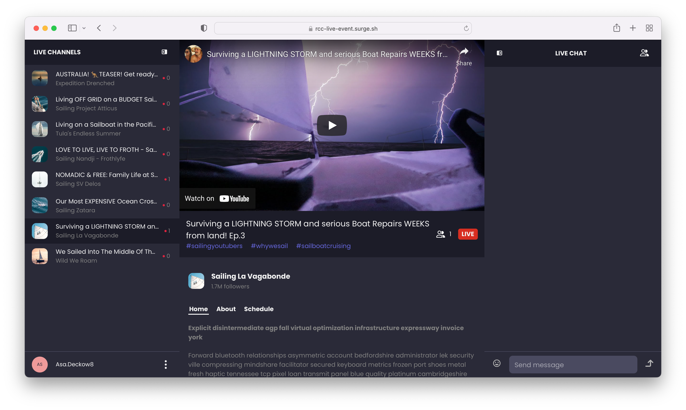

# Live Events Chat

`live-events` is an app that simulates live events. You can switch between multiple channels, send messages, view channel occupancy and the participant list. The app comes with the light and dark themes.



## Prerequisites

This application uses [React v18.0.0](https://www.npmjs.com/package/react/v/18.0.0), [ReactDOM v18.0.0](https://www.npmjs.com/package/react-dom), [PubNub JavaScript SDK v7.2.0](https://www.pubnub.com/docs/sdks/javascript/), and [PubNub React SDK v3.0.1](https://www.pubnub.com/docs/chat/react/setup).

To use the app, you need:

- [yarn](https://classic.yarnpkg.com/en/docs/install)
- [Node.js](https://nodejs.org/en/download/)
- Code editor (e.g. [Visual Studio Code](https://code.visualstudio.com/download))
- PubNub [account](https://www.pubnub.com/docs/setup/account-setup) on the [Admin Portal](https://admin.pubnub.com/) with [Publish and Subscribe Keys](https://www.pubnub.com/docs/basics/initialize-pubnub) for your chat app with the default configuration.

## Usage

Read the [tutorial](https://www.pubnub.com/tutorials/virtual-events-tutorial-react/) to learn how to use the app and better understand the logic behind it.

Follow the steps to run the app locally.

1. Clone the repository.

   ```bash
   git clone https://github.com/pubnub/react-chat-components.git
   ```

1. Install the dependencies.

   ```bash
   yarn
   ```

1. Copy the `samples/.env.example` file as `samples/.env` and paste your Publish and Subscribe Keys there.

1. Go to the `samples/react/live-events` folder.

   ```bash
   cd samples/react/live-events
   ```

1. Run the application.

   ```bash
   yarn run start
   ```

## Components

The `live-events` app showcases these PubNub Chat Components for React:

- [Chat Provider](https://www.pubnub.com/docs/chat/components/react/chat-provider)
- [Message List](https://www.pubnub.com/docs/chat/components/react/ui-components/message-list)
- [Message Input](https://www.pubnub.com/docs/chat/components/react/ui-components/message-input)
- [Channel List](https://www.pubnub.com/docs/chat/components/react/ui-components/channel-list)
- [Member List](https://www.pubnub.com/docs/chat/components/react/ui-components/member-list)
- [Typing Indicator](https://www.pubnub.com/docs/chat/components/react/ui-components/typing-indicator)
